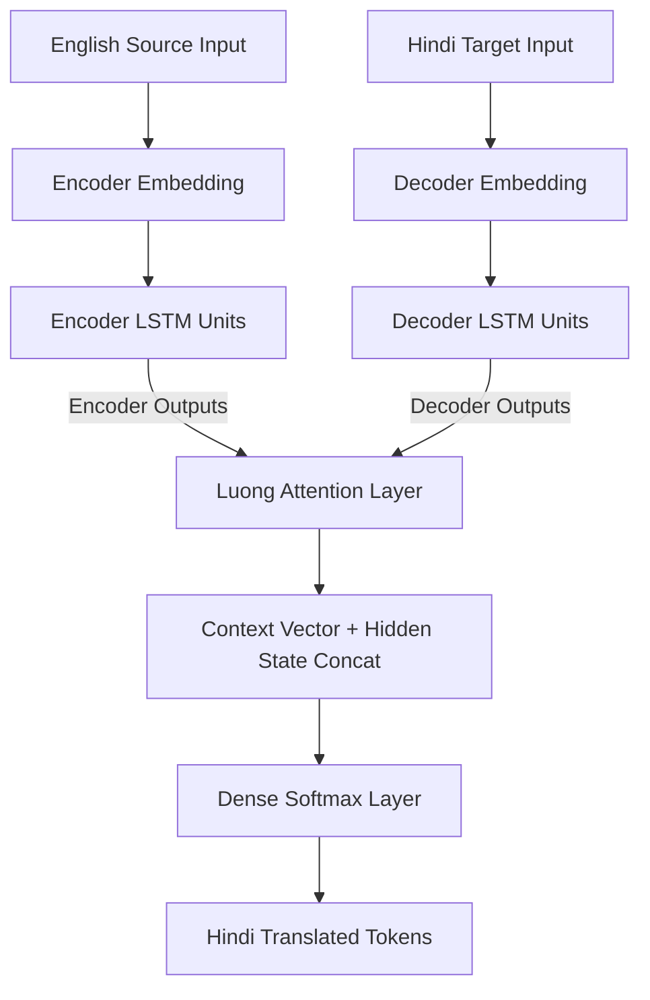

<div align="center">

  <!-- Animated Header Banner -->
  

  <p align="center">
    <b>A State-of-the-Art Sequence-to-Sequence Deep Learning Pipeline for Machine Translation</b>
  </p>

  <!-- Badges Grid -->
  <p align="center">
    <a href="https://colab.research.google.com"></a>
    <a href="https://www.python.org/"></a>
    <a href="https://www.tensorflow.org/"></a>
    <a href="https://keras.io/"></a>
    <a href="https://opensource.org/licenses/MIT"></a>
  </p>

  <p align="center">
    <a href="#-key-features">Key Features</a> •
    <a href="#-architecture--data-flow">Architecture</a> •
    <a href="#-dataset--preprocessing">Preprocessing</a> •
    <a href="#-model-implementation">Code</a> •
    <a href="#-benchmarks">Performance</a> •
    <a href="#-inference--results">Results</a>
  </p>

  

</div>


## 📋 Table of Contents
- [✨ Key Features](#-key-features)
- [🧠 Architecture \& Data Flow](#-architecture--data-flow)
- [📊 Dataset \& Preprocessing](#-dataset--preprocessing)
- [⚡ Model Implementation](#-model-implementation)
- [📈 Benchmarks](#-benchmarks)
- [🔮 Inference \& Results](#-inference--results)
- [🚀 Quick Start](#-quick-start)
- [🤝 Contributing \& License](#-contributing--license)

---

## ✨ Key Features


* 🎯 **Luong Scaled Dot-Product Attention:** Dynamically alignment scoring with vector scaling (`use_scale=True`) to address long-term dependencies in sequence processing.
* 🧹 **Automated NLP Cleaning Pipeline:** Normalizes text, strips punctuation, strips numerical values, and unifies casing across dual-language corpora.
* 🔤 **Dual Vocabulary Management:** Independent tokenization and padding structures tuned specifically for target language distributions (`Eng: 3,843` | `Hin: 4,556`).
* ⚡ **Autoregressive Inference Engine:** Recurrent decoder step-passing model engineered for dynamic sequence output generation.
* 🛡️ **Early Stopping & Weight Restoration:** Dynamic validation tracking preventing overfitting and saving optimal checkpoints automatically.

<br clear="right"/>

---

## 🧠 Architecture & Data Flow

<table>
<tr>
<td width="50%" valign="top">

### 📐 Layer Hyperparameters

| Component | Specification |
| :--- | :--- |
| **Embedding Latent Dim** | `512` |
| **Encoder Units** | `512` (LSTM, Dropout: 0.2) |
| **Decoder Units** | `512` (LSTM, Dropout: 0.2) |
| **Attention Mechanism** | `Luong Scaled Dot-Product` |
| **Loss Function** | `Sparse Categorical Crossentropy` |
| **Optimizer** | `Adam` |

</td>
<td width="50%" valign="top">

### 🔄 End-to-End Pipeline



---

## 📊 Dataset & Preprocessing

The model is trained on a curated translation subset extracted from the **TED Talk Hindi-English Parallel Corpus**.

```python
import string

def clean_text(text: str) -> str:
    """Standardizes input string by stripping punctuation, 
    digits, and applying lowercasing."""
    text = str(text).lower()
    text = text.translate(str.maketrans("", "", string.punctuation))
    text = text.translate(str.maketrans("", "", string.digits))
    return text.strip()

# Apply to parallel sentence dataframes
lines['english_sentence'] = lines['english_sentence'].apply(clean_text)
lines['hindi_sentence']   = lines['hindi_sentence'].apply(clean_text)

```

---

## ⚡ Model Implementation

```python
import tensorflow as tf
from tensorflow.keras.models import Model
from tensorflow.keras.layers import Input, LSTM, Dense, Concatenate, Embedding, Attention

# Latent dimensional space specification
latent_dim = 512

# ---------------------------------------------------------------------
# 1. ENCODER ARCHITECTURE
# ---------------------------------------------------------------------
encoder_input = Input(shape=(None,), name="encoder_input")
encoder_embedded = Embedding(
    input_dim=eng_vocab_size, 
    output_dim=latent_dim, 
    name="encoder_embedding"
)(encoder_input)

encoder_outputs, state_h, state_c = LSTM(
    units=latent_dim, 
    return_sequences=True, 
    return_state=True, 
    dropout=0.2, 
    name="encoder_lstm"
)(encoder_embedded)

encoder_states = [state_h, state_c]

# ---------------------------------------------------------------------
# 2. DECODER ARCHITECTURE
# ---------------------------------------------------------------------
decoder_input = Input(shape=(None,), name="decoder_input")
decoder_embedded = Embedding(
    input_dim=hin_vocab_size, 
    output_dim=latent_dim, 
    name="decoder_embeddings"
)(decoder_input)

decoder_outputs, _, _ = LSTM(
    units=latent_dim, 
    return_sequences=True, 
    return_state=True, 
    dropout=0.2, 
    name="decoder_lstm"
)(decoder_embedded, initial_state=encoder_states)

# ---------------------------------------------------------------------
# 3. LUONG ATTENTION & COMBINED OUTPUT
# ---------------------------------------------------------------------
attention_layer = Attention(use_scale=True, name="luong_attention")
context_vector = attention_layer([decoder_outputs, encoder_outputs])

decoder_combined_context = Concatenate(axis=-1, name="concat_layer")([
    decoder_outputs, 
    context_vector
])

decoder_dense = Dense(hin_vocab_size, activation="softmax", name="output_layer")
decoder_final_output = decoder_dense(decoder_combined_context)

# ---------------------------------------------------------------------
# 4. MODEL COMPILATION
# ---------------------------------------------------------------------
model = Model([encoder_input, decoder_input], decoder_final_output)
model.compile(
    optimizer="adam", 
    loss="sparse_categorical_crossentropy", 
    metrics=["accuracy"]
)

```

---

## 📈 Benchmarks

Training metrics across a 2,500 sentence-pair subset (80/20 train-validation split):

| Epoch | Train Loss | Train Accuracy | Val Loss | Val Accuracy | Progress |
| --- | --- | --- | --- | --- | --- |
| **01** | `2.8609` | `69.66%` | `2.0314` | `72.86%` | █░░░░░░░░░ |
| **03** | `1.9126` | `72.21%` | `2.0175` | `72.90%` | ███░░░░░░░ |
| **05** | `1.8200` | `72.53%` | `2.0110` | `73.11%` | █████░░░░░ |
| **08** | `1.6337` | `73.44%` | `2.0289` | `73.59%` | ████████░░ |

---

## 🔮 Inference & Results

Below are sample qualitative predictions generated by the autoregressive decoder pipeline:

> 💬 **Input Sentence:** `we still dont know who her parents are who she is`
> 🎯 **Predicted Output:** `हम अभी तक नहीं जानते हैं कि उसके मातापिता कौन हैं`

---

> 💬 **Input Sentence:** `no keyboard`
> 🎯 **Predicted Output:** `कोई कुंजीपटल नहीं`

---

> 💬 **Input Sentence:** `and this particular balloon`
> 🎯 **Predicted Output:** `और यह खास गुब्बारा`

---

## 🚀 Quick Start

1. **Clone the Repository**
```bash
git clone [https://github.com/your-username/english-to-hindi-nmt.git](https://github.com/your-username/english-to-hindi-nmt.git)
cd english-to-hindi-nmt

```


2. **Install Dependencies**
```bash
pip install tensorflow numpy pandas matplotlib

```


3. **Train the Model**
```bash
python train.py

```


---

## 🤝 Contributing & License

Contributions, issues, and feature requests are welcome! Feel free to check the [issues page](https://www.google.com/search?q=../../issues).

Distributed under the **MIT License**. See `LICENSE` for more information.

### ⭐ Don't forget to star this repository if you found it helpful!
